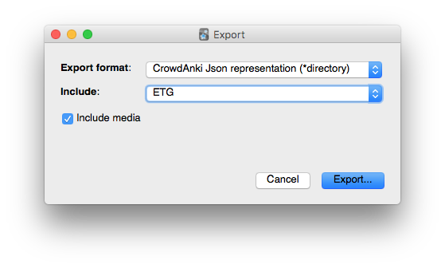

# Machine_Learning_ANKI

__Q__: What is Anki?

__A__: Anki is a spaced repetition flashcard program.

To learn more, take a look at https://apps.ankiweb.net and the [docs](https://apps.ankiweb.net/docs/manual.html#introduction).

# available decks

- __ML Notes__

# how to use a deck

- clone this repository
- get [Anki for desktop](https://apps.ankiweb.net) (Linux, Windows, macOS)
- install the [CrowdAnki Plugin](https://ankiweb.net/shared/info/1788670778):
  - open Anki
  - click _Tools_, _Add-ons_, _Browse & Install..._
  - enter plugin id `1788670778`
  - restart Anki
- click _File_, _CrowdAnki: import from Disk_
  - select the folder of the deck that you'd like to import
- optional: [create an Anki account](https://ankiweb.net/account/register) to sync your decks, this allows you to
  - learn on your phone/tablet
  - learn using the [web interface](https://ankiweb.net/decks/)

# how to help out

[Fork](https://help.github.com/articles/fork-a-repo/) this repository, and send me a [pull request](https://help.github.com/articles/creating-a-pull-request/).

You can edit the JSON directly (useful for minor fixes) or use Anki itself to make changes and create new cards.

## editing with Anki

1. import the deck as per the previous section
2. edit the cards and/or create new ones
3. export your deck as _CrowdAnki Json Representation_

</img>

4. select the directory of this repo as a target

# conventions

- formulas are written in LaTeX
- try to keep questions and answers concise
- don't hotlink images, add them locally instead
- optional information, that's not neccessary to answer a question, follows a horizontal ruler tag (`
`)
